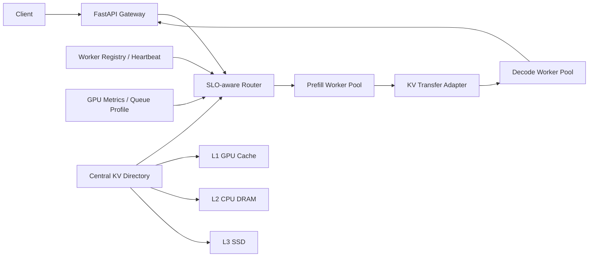

# PDCacheServe

基于 Prefill-Decode 分离与分层 KV Cache 的 SLO 感知大模型推理控制面。

PDCacheServe 将计算密集的 Prefill 和访存密集的 Decode 拆分为独立 Worker Pool，
以中心化元数据目录管理分布在 GPU、CPU DRAM 与 SSD 的 KV Cache，并根据队列、
GPU 负载、Cache 亲和度、传输开销和 TTFT/TPOT SLO 完成跨池请求路由。

> 本仓库的自研范围是推理控制面、调度策略、缓存元数据、安全回收和 Benchmark。
> 实际模型执行与 GPU 间 KV 传输通过 vLLM、LMCache、NIXL 等后端适配，不宣称从零
> 实现 CUDA/RDMA 传输引擎。

## 为什么做这个项目

Prefill 与 Decode 的资源特征不同，拆分后可以独立放置和扩缩容，但分离并不保证吞吐
必然提高：KV 传输、较短请求及低负载都可能使聚合式服务更快。项目因此以满足 TTFT、
TPOT 的 Goodput 为主要目标，并保留 Aggregated Baseline 和负面实验结果。

相关设计参考：

- [vLLM Disaggregated Prefilling](https://docs.vllm.ai/en/stable/features/disagg_prefill/)
- [vLLM LMCache/NIXL Examples](https://docs.vllm.ai/en/stable/examples/disaggregated/lmcache/)
- [NVIDIA Dynamo Disaggregated Serving](https://docs.nvidia.com/dynamo/dev/knowledge-base/concepts/system-architecture/disaggregated-serving)
- [Mooncake](https://arxiv.org/abs/2407.00079) 与 [DistServe](https://www.usenix.org/conference/osdi24/presentation/zhong-yinmin)

## 架构



核心模块：

- `WorkerRegistry`：角色注册、GPU 画像、心跳更新与失联 Fencing；
- `KVDirectory`：模型布局兼容性、Prefix 位置、TTL、Lease、LRU 和分层容量；
- `SLORouter`：穷举兼容 P/D Pair，预测 TTFT、TPOT 与 KV Transfer，执行准入；
- `ControlPlane`：路由统计、Cache 失效和可观测指标；
- `HTTPPDExecutor`：对接实现 `/internal/prefill` 与 `/internal/decode` 契约的
  vLLM/LMCache Sidecar；
- `simulator`：相同 Trace 下对比 Aggregated、PD Round Robin、Load-aware 和 KV-aware。

详细设计见 [`docs/architecture.md`](docs/architecture.md)，双 GPU 接入步骤见
[`deploy/vllm/README.md`](deploy/vllm/README.md)。

## 快速运行

```bash
python3 -m venv .venv
source .venv/bin/activate
python -m pip install -e '.[api,dev]'

pdserve demo
pytest -q
pdserve benchmark
pdserve serve --port 8200
```

浏览器访问 `http://127.0.0.1:8200/docs`。默认 `/v1/completions` 使用模拟执行器；
只有配置真实 P/D Sidecar 后才应设置 `PDSERVE_EXECUTOR=http`。

Docker：

```bash
docker compose up --build
curl http://127.0.0.1:8200/healthz
```

## 双卡真实 GPU 验证

仓库内置了针对同机双 GPU 的固定部署：GPU 0 运行 Prefill，
GPU 1 运行 Decode，vLLM 原生 `NixlConnector` 通过 NIXL/UCX 传输 KV。
启动前必须通过双向 CUDA Peer Access 预检。

```bash
# 默认模型目录：/root/autodl-tmp/models/Qwen2.5-7B-Instruct
bash deploy/real_gpu/launch_pd.sh

pdserve gpu-benchmark \
  --url http://127.0.0.1:8000 \
  --model Qwen2.5-7B-Instruct \
  --requests 20 --concurrency 2 \
  --input-tokens 2048 --output-tokens 128 \
  --shared-prefix --ignore-eos \
  --output artifacts/real-gpu/pd-shared-prefix.json

bash deploy/real_gpu/stop.sh
```

聚合式原生 vLLM 基线使用 `launch_aggregated.sh`，实验时保持模型、
Trace、显存比例和 SLO 一致。详细运行顺序见
[`deploy/real_gpu/README.md`](deploy/real_gpu/README.md)。

## Benchmark

当前仓库保存的是离散事件仿真，不是 GPU 实测：10 个随机种子、三档负载、四种策略，
每个 workload/seed 300 个请求，共 120 组策略运行、36,000 个策略请求。

KV-aware 相比 PD Round Robin：

| Workload | P95 TTFT | Goodput | SLO 达标率 |
| --- | ---: | ---: | ---: |
| Short | -49.71% | +4.47% | +4.07 pct |
| Mixed | -31.41% | +20.41% | +13.43 pct |
| Long | -24.58% | +16.87% | +12.37 pct |

在当前 PCIe 异构画像下，Aggregated 的绝对 TTFT 和 Goodput 仍然更好。这证明 PD
分离需要结合高速互联、长上下文、严格 TPOT SLO 或独立扩缩容需求选择，不能把论文中的
上限收益直接搬到本项目。完整数据见 [`artifacts/benchmark/report.md`](artifacts/benchmark/report.md)。

## API

| Method | Path | Purpose |
| --- | --- | --- |
| `POST` | `/v1/workers` | 注册 Prefill/Decode Worker 与模型布局 |
| `POST` | `/v1/workers/{id}/heartbeat` | 回传队列、GPU、KV 与吞吐画像 |
| `POST` | `/v1/cache` | 登记分层 KV Cache 元数据 |
| `POST` | `/v1/routes` | 返回 SLO-aware P/D Placement |
| `POST` | `/v1/completions` | 路由并调用模拟或 HTTP P/D 执行器 |
| `POST` | `/v1/maintenance/fence` | 隔离失联 Worker 并失效其 Cache |
| `GET` | `/metrics` | 控制面计数与 Cache 使用量 |

## 项目边界

- 已完成：控制面、分层 KV 目录、SLO 路由、执行器契约、API/CLI、仿真、测试和 Docker；
- 已提供：vLLM/LMCache/NIXL 真实执行路径、P/D Proxy、启动脚本和
  TTFT/TPOT/Goodput 实测工具；
- 实测指标仅在 `artifacts/real-gpu/` 中保存完整运行记录后对外引用；
- 不包含：自研 CUDA Kernel、自研 RDMA 数据面、模型权重或未经验证的生产 SLA。

## License

Apache-2.0
